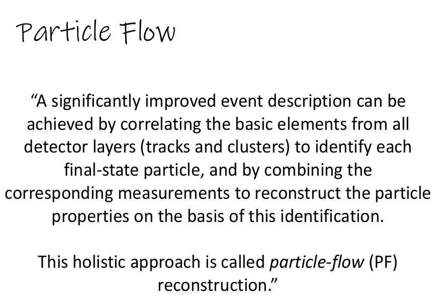
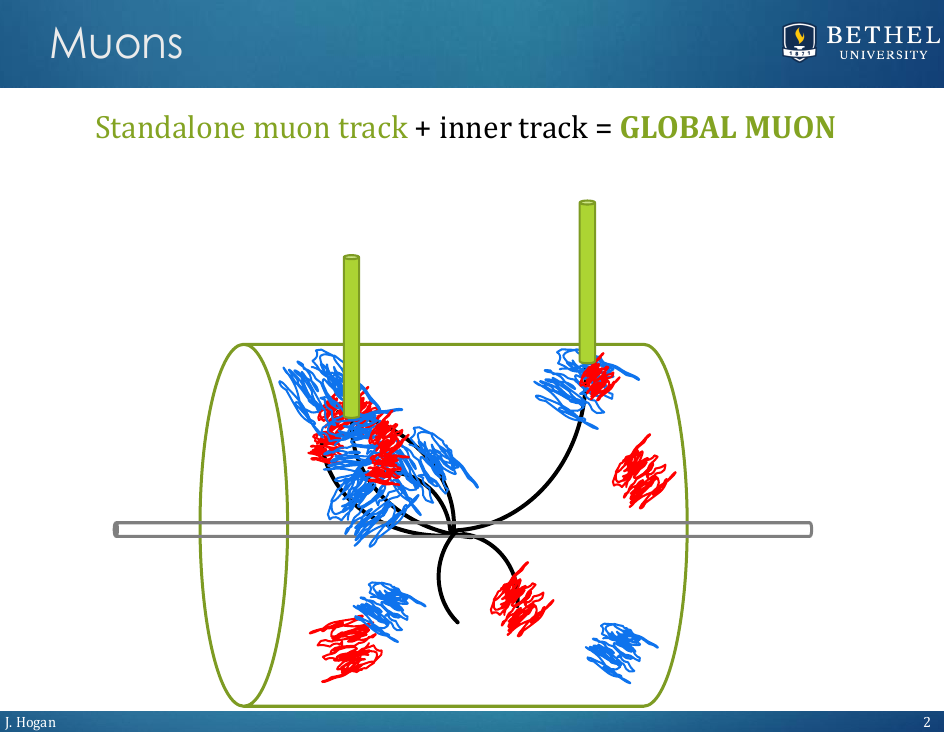
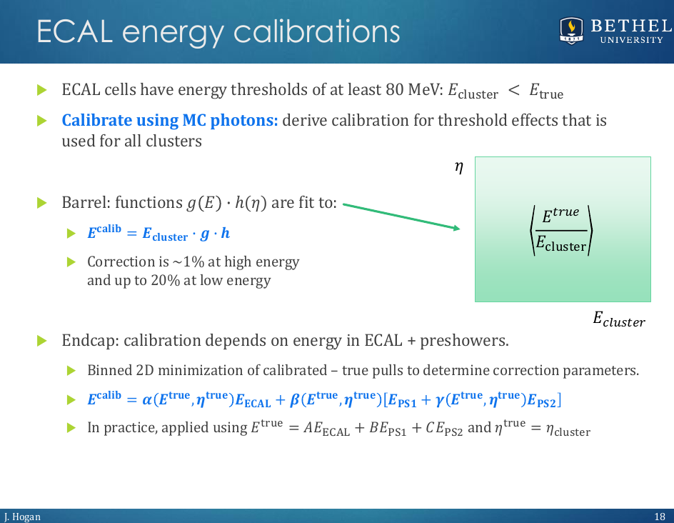

## Overview

In the last episode, you learned about how electromagnetic objects are reconstructed using methods like clustering and linking of tracks with ECAL energy deposits.  These actions are essential parts of the so-called **Particle Flow** (PF) algorithm.

The particle-flow algorithm aims at reconstructing and identifying all stable particles in the event, i.e., electrons, muons, photons, charged hadrons and neutral hadrons, with a thorough combination of all CMS sub-detectors towards an optimal determination of their direction, energy and type. This list of individual particles is then used, as if it came from a Monte-Carlo event generator, to build jets (from which the quark and gluon energies and directions are inferred), to determine the missing transverse energy (which gives an estimate of the direction and energy of the neutrinos and other invisible particles), to reconstruct and identify taus from their decay products and more. 

## Clustering, blocking and linking

To dig deeper into the logic of the main tasks needed in a PF algorithm for reconstruction, please read [these slides](../files/Askew_Clustering_Block.pdf) from one of our CMS colleages.  Answer the questions below in our [assignment form](https://forms.gle/sMyuLFiYJWRsUAew6).

**Question #5**:
What does the energy of a clustering seed in the calorimeters need to be? 

**Question #6**:
What are blocks?

## Particles and corrections

After reading about forming blocks, you're probably getting an idea of how the final particle identifications might be made from all the elements of a block.

The image below shows a cartoon of several possible blocks. ECAL clusters are shown in red and HCAL clusters are shown in blue. Inner tracks are drawn as black curves and muon chambers tracks (also called *standalone* muons) are depicted in green. The first physics objects that are built from blocks of clusters and tracks are **global muons**.

Note that the global muon on the left might not be isolated (there is a lot of track activity around), while the one on the right does seem to be an isolated one (of course, muons can also leave energy in the calorimeters). But the best particle hypothesis where muon tracks appear is "muon"! Any clusters or tracks linked to these standalone muons can now be removed from their respective blocks as global muon objects. 

The remaining block elements are sorted into particle hypotheses in the following order:
 * Isolated electrons are constructed from any ECAL clusters linked only to an inner track. 
 * Isolated photons are constructed from any ECAL clusters not linked to a track. Only very low-energy linked HCAL clusters are allowed in an isolated photon. 
 * Non-isolated photons are constructed from any other ECAL clusters without track links.
 * Neutral hadrons are constructed from any HCAL clusters withour track links
 * Charged hadrons make up everything that's left! Each track remaining in the block is assigned as a single charged hadron object. 

So each cluster and track in each block is sorted into a single particle hypothesis. At each step, decisions have to be made about how to assign the new particle an energy and direction. CMS generally relies on inner tracks for momentum and direction measurements for the charged particles, and relies on calorimeter clusters for the energies of electrons, photons, and hadrons. These cluster energies need calibration, like this example for ECAL clusters: 

Some particle hypothesis directly connect to physics objects: muons, electrons, and photons. Others are built from combining PF particles (often called "candidates") into larger structures. For example, jet clustering algorithms can be used to form jets from showers of non-isolated electrons, muons, photons, and hadrons. In the first cartoon image of PF blocks, the activity on the left could be identified as a jet. Most algorithms in CMS use PF candidates.

As it was mentioned in the beginning, a list of physics object can be found in this [guide](https://opendata.cern.ch/docs/cms-physics-objects-2011#list-of-cms-physics-objects) from the CODP.  There, one can also find extended references.


